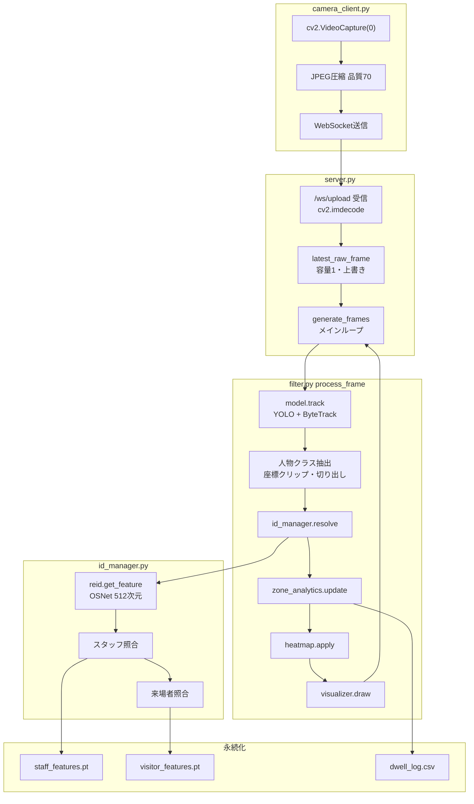

# データフロー設計

カメラ映像を受け取ってから、ブラウザに表示し、滞在ログを記録するまでの流れをまとめる。

最終更新: 2026-09-25 / 対象コミット: main

---

## 1. 構成

システムは3つの起動方法を持つ。

| ファイル | 役割 | 入力 | 出力 |
|---|---|---|---|
| `server.py` | AIサーバ（FastAPI） | WebSocketで受信したJPEG | MJPEGストリーム |
| `camera_client.py` | カメラクライアント | ローカルカメラ | WebSocketでJPEG送信 |
| `camtest.py` | 単独動作版 | ローカルカメラ | OpenCVウィンドウ |

`server.py` + `camera_client.py` が通常の構成。`camtest.py` は1台で完結する検証用で、同じ `filter.process_frame` を呼ぶ。

`camtest.py` は `filter.py` を import するため、実行すると本番の `staff_features.pt` / `visitor_features.pt` / `dwell_log.csv` を読み書きする。検証目的で動かす場合は注意が必要。

---

## 2. 全体図



---

## 3. 1フレームの処理の流れ

| # | 処理 | 実装 |
|---|---|---|
| 1 | フレーム受信・デコード | `server.py:119-130` |
| 2 | `latest_raw_frame` に上書き保存 | `server.py` |
| 3 | 取り出してコピー、元を `None` に | `server.py` |
| 4 | スタッフ登録（フラグが立っていれば） | `server.py:180-188` |
| 5 | コントラスト調整 | `filter.py:7`（現状 `1.0, 0` で変化なし） |
| 6 | YOLO + ByteTrack | `filter.py:20` |
| 7 | 人物クラス抽出・座標クリップ・切り出し | `filter.py` |
| 8 | Re-IDによるID判定 | `filter.py:42` → `id_manager.py:116` |
| 9 | ブース判定・滞在時間・CSV記録 | `filter.py:79` → `zone_analytics.py:31` |
| 10 | ヒートマップ合成 | `filter.py:80` → `heatmap.py:23` |
| 11 | 枠・ラベル・軌跡の描画 | `filter.py:81` → `visualizer.py:6` |
| 12 | JPEGエンコード・MJPEG送出 | `server.py:220-236` |

**フレームバッファは容量1。** 処理中に届いたフレームは上書きされ、破棄される。捨てた枚数は記録していない。

---

## 4. データの形の変遷

| 段階 | 入力 | 出力 |
|---|---|---|
| WebSocket受信 | JPEGバイト列 | BGR画像 `(H, W, 3)` |
| `model.track` | BGR画像 | `boxes (N,4)`, `conf (N)`, `cls (N)`, `id (N)` |
| 切り出し | `box (4,)` | `crop_img (h, w, 3)` BGR |
| `reid.get_feature` | `crop_img` BGR | 512次元テンソル（**L2正規化なし**） |
| `reid.compare_features` | 特徴量2つ | コサイン類似度（float） |
| `IDManager.resolve` | `track_id`, `crop_img` | `IDMatchResult(real_id, status, label)` |
| `ZoneAnalytics.update` | `tracks`, `frame_shape`, `data_logger` | `(enriched_tracks, booths)` |
| `Visualizer.draw` | 画像, `booths`, `tracks` | 描画済みBGR画像 |

`get_feature` は正規化していないが、`compare_features` が `F.cosine_similarity` でノルム除算を行うため、結果は正規化済みと同一になる。

---

## 5. モジュールの責務

| ファイル | 責務 | 公開する関数 |
|---|---|---|
| `reid.py` | OSNetによる特徴抽出と類似度計算 | `get_feature`, `compare_features` |
| `id_manager.py` | Track_ID → Real_ID の解決、特徴量プール管理 | `IDManager.resolve`, `save_features`, `load_features` |
| `filter.py` | 1フレームの検出・追跡・照合・描画の統合 | `process_frame` |
| `zone_analytics.py` | ブース判定、滞在時間の計算、退場の検出 | `ZoneAnalytics.update` |
| `logger.py` | CSVへの追記 | `DataLogger.record_exit` |
| `heatmap.py` | 足跡ヒートマップの生成と合成 | `HeatmapGenerator.apply` |
| `visualizer.py` | 枠・ラベル・軌跡・ブース枠の描画 | `Visualizer.draw` |

`filter.py` はモジュール読み込み時に `IDManager()` `ZoneAnalytics()` `Visualizer()` を生成する。**`filter` を import した時点で、本番の `.pt` ファイルが読み込まれる。**

---

## 6. ID判定の流れ（`IDManager.resolve`）

```
1. 期限切れセッションの掃除
2. Track_ID が未登録なら Real_ID を新規発行（照合より先に発行される）
3. track_age < WAIT_FRAMES(5) なら status="waiting" を返して終了
   → 特徴量の抽出は行わない
4. reid.get_feature(crop_img) で特徴量を抽出
5. スタッフ辞書と総当たり照合
   → 最大スコア >= 0.70 なら status="staff"
   → スコア < 0.90 ならプールに追加（インデックス0は保持し、1を削除）
6. 来場者辞書と総当たり照合
   → 最大スコア >= 0.70 なら status="matched:{score}"
   → スコア < 0.90 ならプールに追加（FIFO、インデックス0を削除）
7. どちらにも一致しなければ status="new_visitor" として新規登録
```

**照合は毎フレーム・全員分に対して行われる。** 一度スタッフと確定したTrack_IDも、次のフレームで再度照合される。

`_find_best_match` は、辞書内の全人物の全特徴量と総当たりし、最大スコアを返す（`id_manager.py:104-114`）。照合回数は「登録人数 × 1人あたりの特徴量数」に比例する。

---

## 7. ブース判定と退場（`ZoneAnalytics.update`）

### ブース定義（`zone_analytics.py:12-15`）

| ブース | 正規化座標 | 実際の領域 |
|---|---|---|
| `Booth_A` | `(0,0) (0.5,0) (0.5,1) (0,1)` | 画面の左半分 |
| `Booth_B` | `(0.5,0) (1,0) (1,1) (0.5,1)` | 画面の右半分 |

**画面全体がいずれかのブースに属する。「ブース外」の状態は存在しない。**

判定に使う座標は、バウンディングボックスの下端中央（`foot_x = (x0+x1)/2`, `foot_y = y1`）。

### 退場が記録される2つの経路

| 経路 | 条件 | `dwell_time` に代入される値 | 実装 |
|---|---|---|---|
| **ブース移動** | 前フレームと異なるブースにいる | `current_time - entry_time` | `zone_analytics.py:62` |
| **ロスト確定** | 画面から消えて `buffer_time`(3.0秒) 経過 | `current_time - entry_time` | `zone_analytics.py:122` |

**ロスト確定の経路では、見失ってから退場が確定するまでの3秒が滞在時間に含まれる。** 入った直後に見失った場合、滞在時間は約3.0秒として記録される。

`record_exit` は `dwell_time < 1.0` の記録を書き込まない（`logger.py:22-24`）。

---

## 8. 設定値の一覧

### 検出・追跡

| 値 | 設定箇所 | 内容 |
|---|---|---|
| `0.6` | `server.py:197`, `camtest.py:65` | YOLOの信頼度閾値（`process_frame` の既定値は `0.5`） |
| `yolo26n.pt` | `server.py`, `camtest.py` | 検出モデル |
| `0.25` | `bytetrack.yaml:7` | `track_high_thresh`（一段階目） |
| `0.1` | `bytetrack.yaml:8` | `track_low_thresh`（二段階目） |
| `0.25` | `bytetrack.yaml:9` | `new_track_thresh` |
| `60` | `bytetrack.yaml:10` | `track_buffer`（ロスト保持フレーム数） |
| `0.8` | `bytetrack.yaml:11` | `match_thresh` |

**`conf=0.6` はYOLOの推論時に渡されるため、0.6未満の検出はByteTrackに渡らない。** `track_low_thresh`〜`track_high_thresh`（0.1〜0.25）の範囲に該当する検出が存在せず、二段階照合は機能しない。

### Re-ID

| 値 | 設定箇所 | 内容 |
|---|---|---|
| `osnet_x1_0` | `reid.py:12` | モデル名 |
| **未指定** | `reid.py:12` | **`model_path` を指定していないため、ImageNet重みで動作する** |
| `0.70` | `id_manager.py:15` | `similarity_threshold`（同一人物の判定） |
| `0.90` | `id_manager.py:20` | `diversity_threshold`（これ以上似ていればプールに追加しない） |
| `5` | `id_manager.py:23` | `MAX_POOL_SIZE`（1人あたりの特徴量数） |
| `5` | `id_manager.py:26` | `WAIT_FRAMES`（照合開始までのフレーム数） |
| `1800` | `id_manager.py:15` | `timeout_seconds`（セッション期限） |

### ゾーン分析・ログ

| 値 | 設定箇所 | 内容 |
|---|---|---|
| `3.0` | `zone_analytics.py:7` | `buffer_time`（ロスト後の退出確定待ち） |
| `30` | `zone_analytics.py:50` | 軌跡履歴の保持点数 |
| `1.0` | `logger.py:23` | これ未満の滞在は記録しない |

### ヒートマップ

| 値 | 設定箇所 | 内容 |
|---|---|---|
| `30` | `heatmap.py:10` | `HEAT_ADD`（足位置への加算値） |
| `0.998` | `heatmap.py:14` | `DECAY_RATE`（毎フレームの減衰率） |
| `0.005` | `heatmap.py:17` | `RADIUS_FACTOR`（円半径 = `min(h,w) × 0.005`） |
| `10.0` | `heatmap.py:20` | `MIN_MAX_HEAT`（正規化分母の下限） |
| `0.6` | `heatmap.py:62` | 合成時のα |
| `1.0` | `heatmap.py:12` | `HEAT_MAX`（定義のみ。`apply` では未使用） |

`show=False` でも、減衰・加算・ぼかし・正規化・カラーマップ適用は実行される。省略されるのは最後の合成のみ。

### 通信・表示

| 値 | 設定箇所 | 内容 |
|---|---|---|
| `ws://localhost:8000/ws/upload` | `camera_client.py:7` | 接続先の既定値 |
| `70` | `camera_client.py:32` | 送信時のJPEG品質 |
| `0.01` | `camera_client.py:40` | 送信間隔（秒） |
| 指定なし | `server.py:220` | 配信時のJPEG品質（OpenCVの既定値） |
| `8000` | `server.py:240` | Uvicornの待ち受けポート |
| `33.3` | `server.py:144` | `target_frame_ms`（約30FPS基準の固定値） |

---

## 9. 描画の色分け（`visualizer.py`）

OpenCVはBGR順である点に注意。

| 対象 | 条件 | BGR値 | 実際の色 | 太さ |
|---|---|---|---|---|
| ブース枠・ブース名 | 常時 | `(255,0,0)` | 青 | 2px |
| 人物の枠・ラベル・軌跡 | `real_id` が `S` で始まる | `(255,100,0)` | 明るい青 | **3px** |
| 人物の枠・ラベル・軌跡 | 来場者・ブース内 | `(0,0,255)` | 赤 | 2px |
| 人物の枠・ラベル・軌跡 | 来場者・ブース外 | `(0,255,0)` | 緑 | 2px |

**ブースが画面全体を覆うため、緑の枠は実際には表示されない。**

ラベルには、スタッフ以外かつブース内のとき滞在時間が付加される。`status` の表示はコメントアウトされている。

---

## 10. 保存されるデータ

### `staff_features.pt`

```python
{"S001": [tensor, tensor, ...], "S002": [...]}
```

読み込み時、値がリストでなければリストに変換される（`id_manager.py:71-74`）。

### `visitor_features.pt`

```python
{
    "active_visitors":   {"R001": [tensor, ...], ...},
    "archived_visitors": {...},
    "last_seen":         {"R001": 1234567890.5, ...},
    "next_real_id":      43,
}
```

### `dwell_log.csv`

```
Timestamp, Booth_name, Track_ID, Real_ID, Status, ReID_Score, Dwell_Time_sec
```

`Status` は `matched_visitor` / `new_visitor` / `staff` / `waiting` のいずれか。`matched:0.85` のような文字列は `filter.py` で分解され、`Status` と `ReID_Score` に振り分けられる。

---

## 11. 性能（実測値）

2026-09-23 に `server.py` + `camera_client.py` の構成で測定。

| 項目 | 値 |
|---|---|
| `Process`（`process_frame` の所要時間） | 15〜25ms（平均約20ms） |
| `FPS`（ループ1周の逆数） | 23〜42 |
| 体感遅延 | 約0.3秒 |

**測定条件**：人物1人、GPU使用、Cloudflare WARP経由、ブラウザ1つ。

### 注意点

- `Process` は人数に比例する。`id_manager.resolve` が全員分呼ばれ、それぞれで特徴量抽出が走るため
- **ブラウザを2つ開くと `FPS` が 9〜45 に乱れる。** `generate_frames` は `/video_feed` へのリクエストごとに実行され、複数のループが `latest_raw_frame` を奪い合うため
- 体感遅延にはネットワーク経路の影響が含まれる

### 計測値の読み方（`server.py`）

| 表示 | 計算式 | 含まれるもの |
|---|---|---|
| `Process` | `display_time - capture_time` | `process_frame` のみ |
| `Loop` | `display_time - frame_start` | 上記＋フレーム取り出し |
| `FPS` | `1 / (display_time - prev_display_time)` | ループ1周全体（描画・送信を含む） |
| `Lag vs camera` | `max(0, Process - 33.3)` | 1フレームあたりの超過分 |

`Lag vs camera` は `max(0, ...)` で下限を切っているため、処理が間に合っている場合は常に `0.0` と表示される。

---

## 12. 既知の課題

実装と設計意図のずれ、および未検証の項目。

| 項目 | 内容 |
|---|---|
| **重みが未指定** | `reid.py` が `model_path` を指定しておらず、ImageNet重みで動作している |
| **期限切れ処理が到達不能** | `_clean_expired_sessions` の条件が矛盾しており、アーカイブ処理が実行されない |
| **滞在時間の水増し** | ロスト確定の経路で、`buffer_time` の3秒が滞在時間に加算される |
| **ブース境界の不安定さ** | 画面中央が境界のため、中央付近で入退場が繰り返し記録される |
| **複数接続時の重複** | `generate_frames` が接続ごとに実行され、処理が多重化する |
| **人物以外も追跡** | `model.track` に `classes` を指定しておらず、全80クラスを追跡してから人物のみ抽出している |
| ByteTrackの二段階目 | `conf=0.6` により、低スコア検出を使った照合が機能しない |
| 検出精度が未評価 | YOLOの再現率を測定していない |
| ID採番の不一致 | `server.py` は `S{len+1:03d}`、`camtest.py` は `S{len:03d}` |
| スタッフ登録時の座標クリップ | `server.py:180` 付近の切り出しに、`filter.py` にあるクリップ処理がない |
